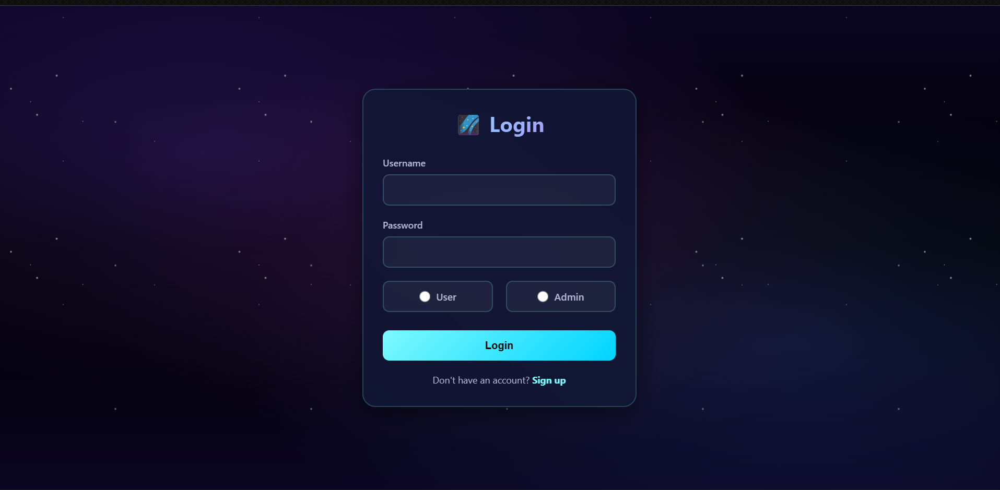
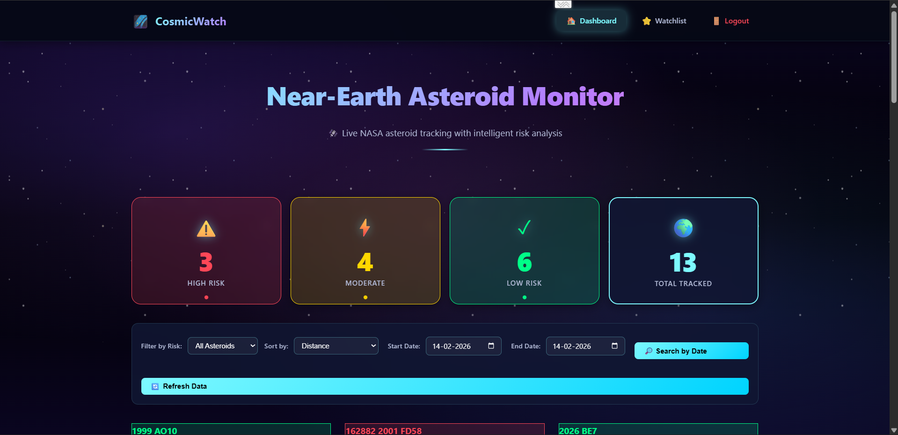
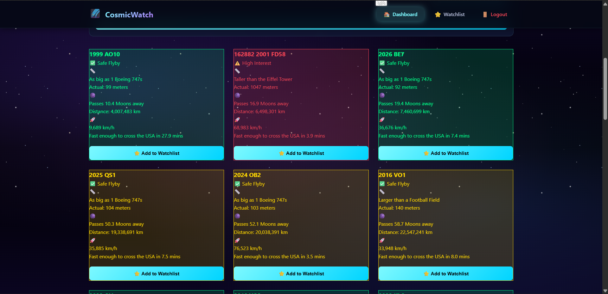
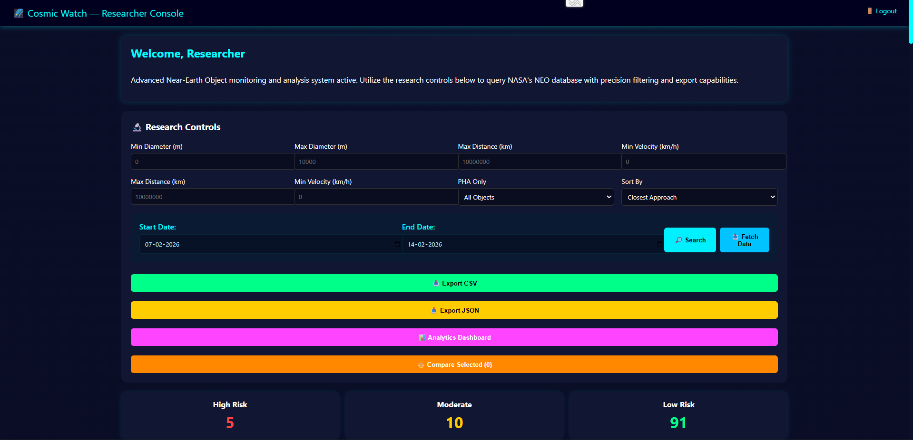
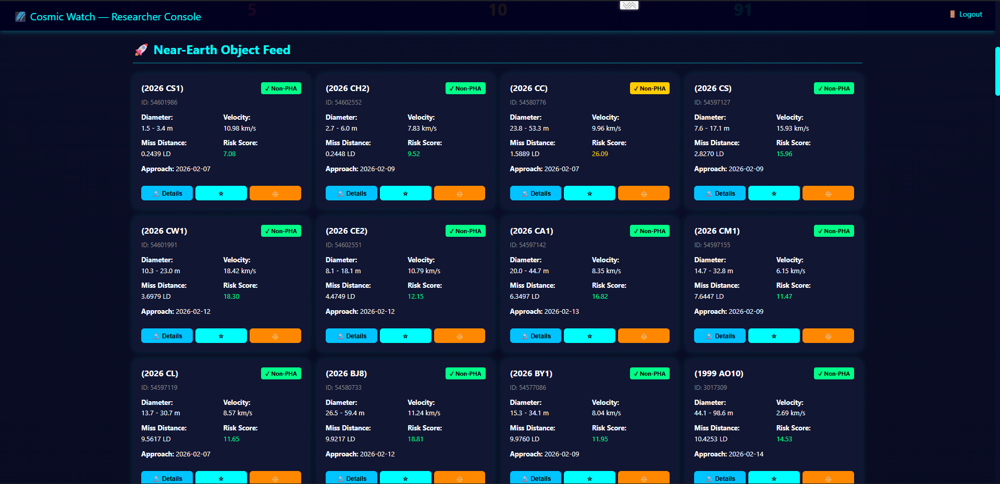
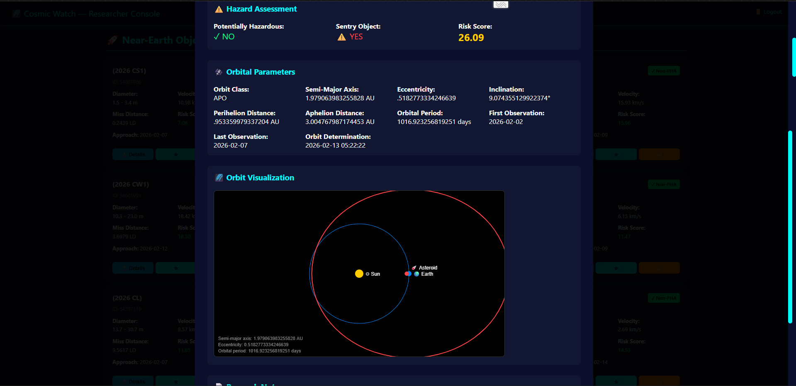
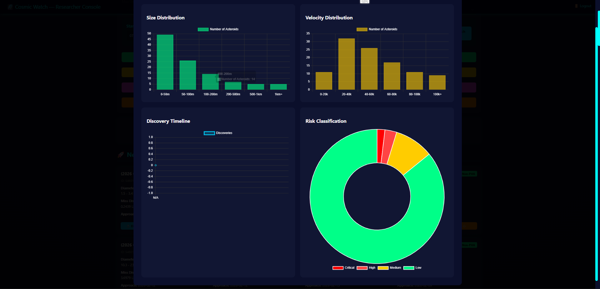

# CosmicWatch

> Role-based Django platform for tracking near-Earth asteroids with NASA NeoWs data, researcher tooling, and community interaction.

[](https://www.python.org/)
[](https://www.djangoproject.com/)
[](https://www.sqlite.org/)
[](https://www.docker.com/)

## Table of Contents
- [Overview](#overview)
- [Features](#features)
- [Tech Stack](#tech-stack)
- [Project Structure](#project-structure)
- [Screenshots](#screenshots)
- [Local Setup](#local-setup)
- [Docker Setup](#docker-setup)
- [Configuration](#configuration)
- [Database](#database)
- [API Endpoints](#api-endpoints)
- [Deployment Notes](#deployment-notes)
- [Security Notes](#security-notes)
- [Roadmap](#roadmap)
- [Contributing](#contributing)
- [License](#license)

## Overview
CosmicWatch is a Django web application with role-based access for:
- Standard users viewing live asteroid intelligence and posting community comments
- Admin/researchers managing deeper analysis tools and private research notes

Asteroid feed data is sourced from NASA NeoWs and presented with risk categorization, filtering, watchlists, and dashboard views.

## Features
- Live asteroid feed using NASA NeoWs (`/neo/rest/v1/feed`)
- Role-based sign-up/login (`Customer` and `AdminUser` profiles)
- User dashboard with:
  - risk summaries (high/medium/low)
  - filtering/sorting/date-range controls
  - watchlist support
  - community comments
- Admin dashboard with:
  - research notes (stored server-side via `/api/notes/`)
  - enhanced asteroid analytics tooling
  - export options and comparison utilities in frontend logic
- Production-oriented static handling with WhiteNoise
- Dockerized runtime

## Tech Stack
- Backend: `Python 3.11+`, `Django 5.2.11`
- Frontend: `HTML`, `CSS`, `JavaScript`
- Database: `SQLite3` (`db.sqlite3`)
- Static/Serving: `WhiteNoise`
- Containerization: `Docker`

## Project Structure
```text
cosmicwatch/
├── accounts/
│   ├── models.py              # Customer/AdminUser role models
│   ├── views.py               # signup/login/logout logic
│   └── templates/accounts/    # auth templates
├── home/
│   ├── models.py              # Note, Comment
│   ├── views.py               # dashboards + JSON APIs
│   ├── urls.py
│   └── templates/home/
├── cosmicwatch/
│   ├── settings.py
│   ├── urls.py
│   └── wsgi.py/asgi.py
├── static/
│   ├── css/style.css
│   └── js/
│       ├── main.js            # user dashboard logic
│       └── admin.js           # admin dashboard logic
├── db.sqlite3
├── Dockerfile
├── requirements.txt
└── manage.py
```

## Screenshots
Add screenshots to `docs/images/` and keep these filenames for clean rendering.

### Login


### User Dashboard


### User Dashboard


### Admin Dashboard


### Admin Dashboard 


### Analytics View


### Analytics View



If images are not yet available, create `docs/images/` first and add files later.

## Local Setup
### 1. Clone
```bash
git clone <your-repo-url>
cd cosmicwatch
```

### 2. Create and activate virtual environment
```bash
python -m venv .venv
```

Windows (PowerShell):
```powershell
.\.venv\Scripts\Activate.ps1
```

macOS/Linux:
```bash
source .venv/bin/activate
```

### 3. Install dependencies
```bash
pip install -r requirements.txt
```

### 4. Apply migrations
```bash
python manage.py migrate
```

### 5. Run development server
```bash
python manage.py runserver
```

Open: `http://127.0.0.1:8000/`

## Docker Setup
Build image:
```bash
docker build -t cosmicwatch .
```

Run container:
```bash
docker run -p 8000:8000 cosmicwatch
```

Open: `http://127.0.0.1:8000/`

## Configuration
Current codebase includes some hardcoded values (API key/admin code/host settings). For production, move these into environment variables.

Recommended environment variables:

| Variable | Purpose | Example |
|---|---|---|
| `DJANGO_SECRET_KEY` | Django secret key | `change-me` |
| `DJANGO_DEBUG` | Debug mode | `False` |
| `DJANGO_ALLOWED_HOSTS` | Allowed hosts list | `example.com,www.example.com` |
| `NASA_API_KEY` | NASA NeoWs API key | `your-nasa-key` |
| `ADMIN_SIGNUP_CODE` | Admin registration code | `rotate-this` |

## Database
Database file: `db.sqlite3`

### Core Domain Tables
- `accounts_customer`
- `accounts_adminuser`
- `home_note`
- `home_comment`
- `auth_user` (Django auth)

### Key Relationships
- `accounts_customer.user_id` -> `auth_user.id` (one-to-one)
- `accounts_adminuser.user_id` -> `auth_user.id` (one-to-one)
- `home_note.user_id` -> `auth_user.id` (many-to-one)
- `home_comment.user_id` -> `auth_user.id` (many-to-one)

### Schema Snapshot (captured February 14, 2026)
#### `accounts_customer`
- `id` INTEGER PK
- `phno` varchar(15) nullable
- `user_id` INTEGER FK

#### `accounts_adminuser`
- `id` INTEGER PK
- `adminno` varchar(15) nullable
- `user_id` INTEGER FK

#### `home_note`
- `id` INTEGER PK
- `text` TEXT
- `created_at` datetime
- `user_id` INTEGER FK

#### `home_comment`
- `id` INTEGER PK
- `text` TEXT
- `created_at` datetime
- `user_id` INTEGER FK

### Data Snapshot (captured February 14, 2026)
- `accounts_adminuser`: `2`
- `accounts_customer`: `7`
- `auth_user`: `10`
- `home_comment`: `3`
- `home_note`: `6`
- `django_session`: `4`
- `django_migrations`: `21`

## API Endpoints
### Auth and pages
- `GET /` -> login page
- `GET /signup/` -> signup page
- `GET /logout/` -> logout action
- `GET /home/` -> user dashboard
- `GET /admin-home/` -> admin dashboard

### Comments API
- `GET /api/comments/` -> list all comments
- `POST /api/comments/` -> create comment (authenticated user required)

Request body:
```json
{ "text": "Your comment" }
```

### Notes API (admin-only)
- `GET /api/notes/` -> list notes for logged-in admin
- `POST /api/notes/` -> create a note for logged-in admin

Request body:
```json
{ "text": "Research note" }
```

## Deployment Notes
- Static files are collected in Docker via:
  - `python manage.py collectstatic --noinput`
- WhiteNoise is enabled in middleware and static storage config.
- Current `ALLOWED_HOSTS` in settings includes Railway host:
  - `cosmic-mid-night-production.up.railway.app`

## Security Notes
Before pushing to production:
- Move hardcoded `SECRET_KEY` to environment config
- Rotate/remove exposed NASA API key from frontend code
- Remove hardcoded admin signup code from `accounts/views.py`
- Add proper CSRF/CORS and rate-limiting policy for public endpoints
- Review `DEBUG`, `ALLOWED_HOSTS`, and trusted origins per environment

## Roadmap
- Add backend proxy for NASA API calls with caching
- Add automated tests for auth and API flows
- Add pagination and moderation tools for comments
- Add CI workflow (lint/test/build)
- Add `.env`-driven settings module split

## Contributing
1. Fork the repository
2. Create a feature branch
3. Commit with clear messages
4. Open a pull request with testing notes

## License
Add a `LICENSE` file and set your preferred license (for example: MIT).

## Author

Rohit Jain  
LinkedIn: https://www.linkedin.com/in/546-rohit-jain
